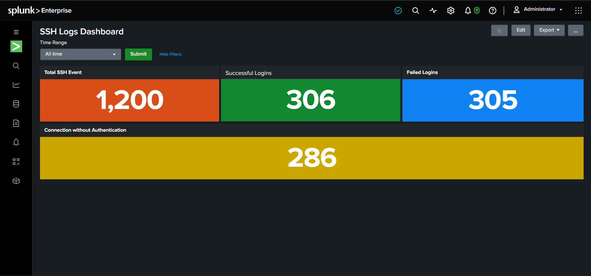
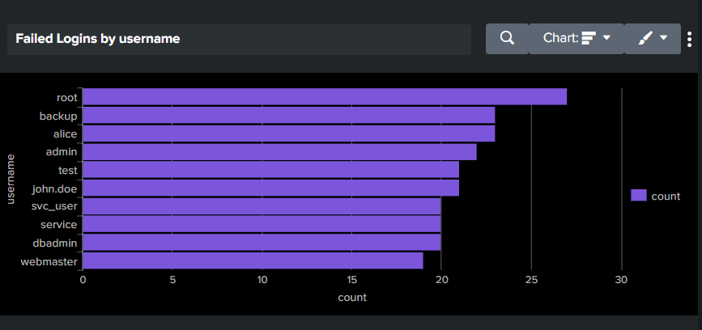
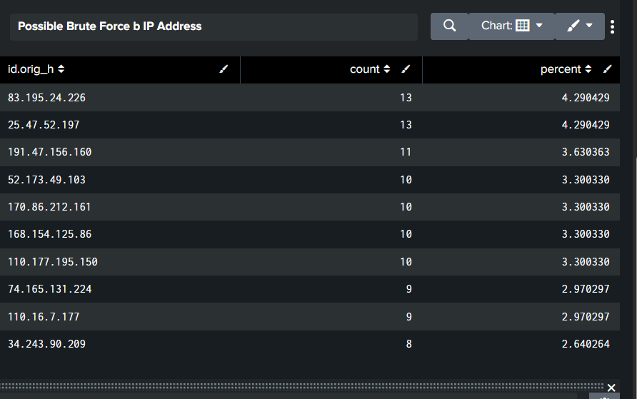
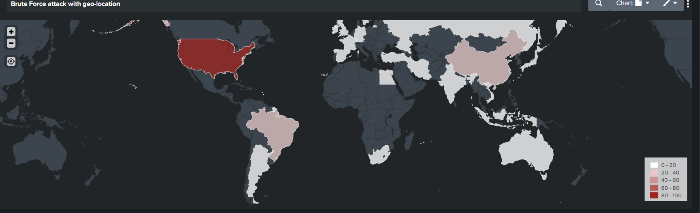

# Splunk SSH SIEM Dashboard

A Splunk dashboard for monitoring SSH authentication activity, detecting brute-force login attempts, and visualizing attacker geo-location — built as a hands-on SIEM/log analysis project.

## Overview

This project ingests SSH authentication logs into Splunk and builds a single dashboard that answers three questions analysts care about during an SSH-focused investigation:

1. **How much SSH activity is there, and how much of it is failing?** (Authentication Overview)
2. **Who/what is being targeted, and is there a pattern that looks like brute forcing?** (Login Activity Trends)
3. **Where in the world are the attack attempts coming from?** (Geo-location Visualization)

A shared time range token (`time_range`) drives every panel, so the whole dashboard can be re-scoped to any time window from one control.

## Dashboard Preview

### Task 1 — Authentication Overview

Total SSH Events, Successful Logins, Failed Logins, and Connection without Authentication, all sharing the same time picker.

### Task 2 — Login Activity Trends

**Failed Logins by Username**

**Possible Brute Force by IP Address**

### Task 3 — Brute Force Geo-location

The US, China, and Brazil stand out as the top sources of failed-authentication attempts in this dataset, with the US in the highest bucket (80–100 attempts).

## Project Structure
